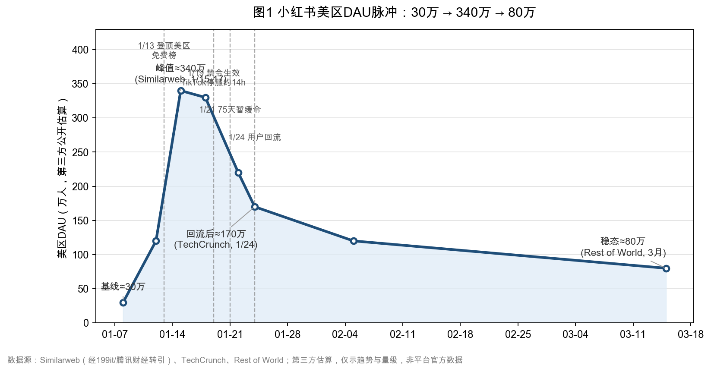
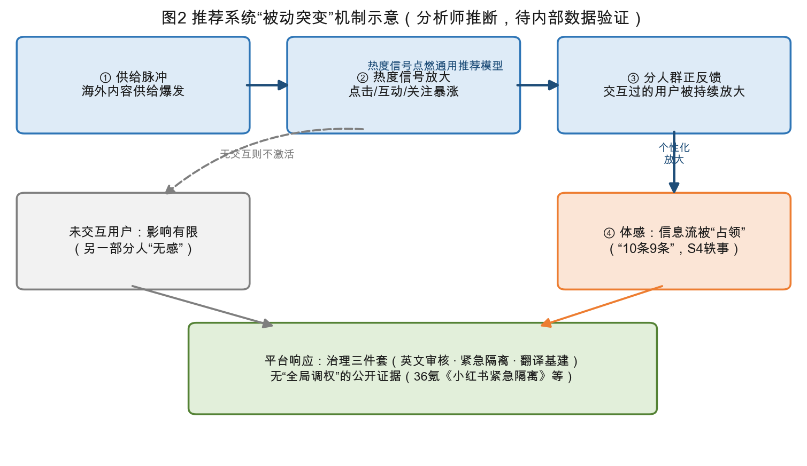
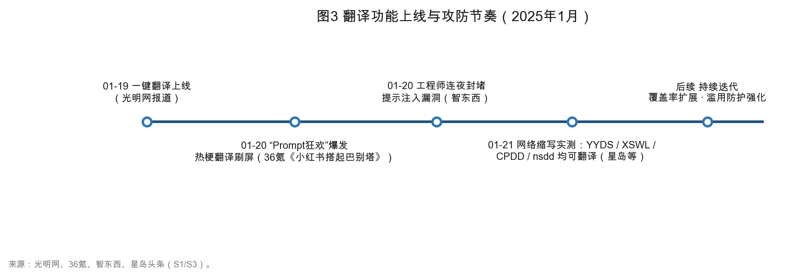
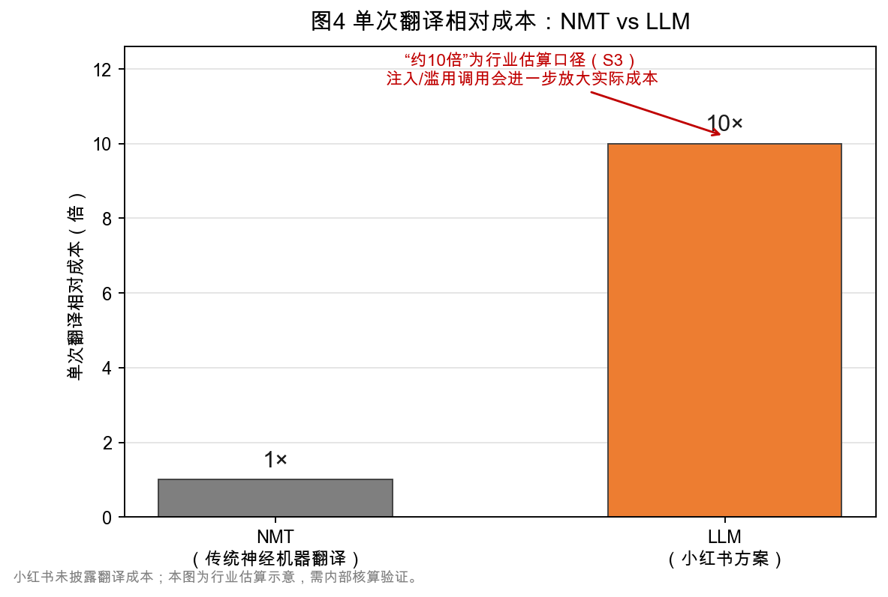
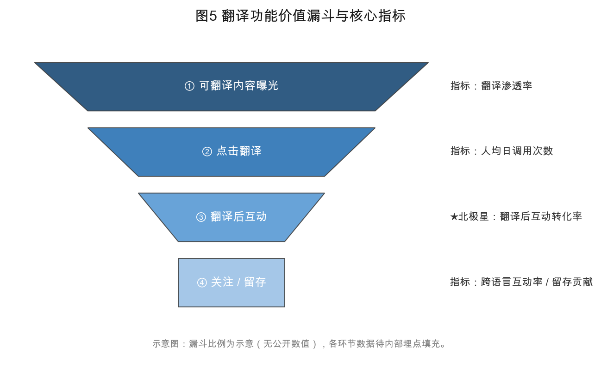
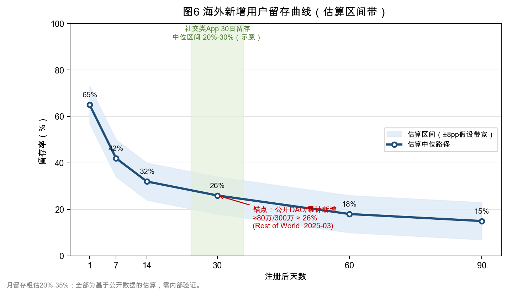
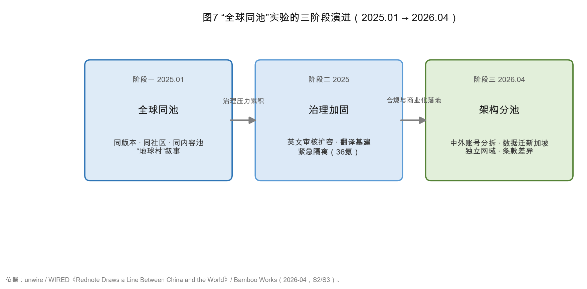

# 小红书「TikTok难民潮」数据产品分析报告

- **报告日期**：2026-08-24（事件发生后约19个月，具备完整后视镜视角）
- **分析视角**：数据产品分析师
- **数据可信度分级**：
  - **S1** 平台官方数据 / 官方表态
  - **S2** 第三方监测机构数据（Similarweb、Sensor Tower、Rest of World 等）
  - **S3** 媒体转述、券商研报、行业分析
  - **S4** 用户帖文 / 轶事证据（未经统计验证）
- **重要声明**：本报告基于公开信源撰写。小红书内部指标（信息流分布、CTR、留存、翻译调用量等）从未公开，凡涉及均标注为「估算」或「待内部验证」，并给出可执行的验证口径与埋点方案。
- **图表说明**：文中图1-图7为基于公开信源数据/估算绘制的示意图，口径详见各图注；涉及内部数据的图表未以虚构数值填充。

---

## 一、执行摘要（关键发现）

1. **流量脉冲的量化轮廓（S2/S3）**：2025年1月13-14日小红书登顶美区 App Store 免费榜；Similarweb 估算美国 DAU 一周内从约30万飙升至 **340万**（单日净增近300万、周环比+10倍），累计新增美国用户约300万；此后快速衰减——1月24日前后（TikTok 恢复、特朗普签署75天暂缓令）DAU 即**腰斩**，至2025年3月 Rest of World 数据显示美区 DAU 回落至约 **80万**（全球 DAU 610万），较峰值下降约76%（见图1）。
2. **推荐侧没有证据表明"全局调权"，更可能是供给与热度信号的被动放大（推断）**：海外内容供给在数日内爆炸式增长，叠加通用推荐模型的热度特征（点击/互动/转发短期暴涨），自然产生"信息流被占领"；对点击过相关内容的用户进一步形成个性化正反馈。用户所称"推10条混1条"（平时）与"10条里9条"（事件中）均为轶事证据（S4），但方向与上述机制一致。平台公开动作集中在**治理与基建**（连夜招聘英文审核、紧急隔离措施、翻译上线），而非调推荐权重。
3. **翻译功能是本次事件中评分最高的产品动作（S1/S3）**：2025年1月19日上线"一键翻译"，次日即引爆"Prompt 狂欢"——可翻译 YYDS/XSWL/cxk/CPDD/nsdd 等中文网络缩写，乃至摩斯密码、Unicode、西姆语（媒体实测，S3）；同时因 LLM 可被提示注入而出现"被诱导输出非翻译内容"的漏洞，工程师连夜封堵。选 LLM 而非 NMT 是**体验优先**的决策：翻译"梗"的能力是跨文化社区的关键体验，API 接入的开发速度也适配战时节奏；"成本高约10倍"为行业估算（S3），需内部核算验证。
4. **"全球同池"实验在约15个月后正式终结（S2/S3）**：2026年4月，小红书将中国区与海外账号分拆，国际版数据迁至新加坡、用户强制跳转独立网域、服务条款差异化（unwire、WIRED《Rednote Draws a Line Between China and the World》、Bamboo Works 报道）。这回答了最初的战略之问：在治理、合规与商业化的三重压力下，小红书最终选择了**"软分服"**，而非维持无差别同池。
5. **留存下来的海外基本盘不可忽视（S2/推断）**：按公开数据粗算，2025年3月美区 DAU 80万 ≈ 累计新增300万的约26%，月级留存粗估落在 **20-35%** 区间（估算，需内部验证，见图6），高于"纯抗议性迁移"的预期，低于"常态化国际产品"标准。这批用户是小红书国际化的种子池，也是2026年拆分国际版的基础。
6. **事件的长期商业价值体现为"催化器"而非"用户数"（S3）**：私募估值从约170亿美元级别升至 **500亿美元**（2025年报道），2026年传出聘任投行、寻求 **700亿美元+** 估值的港股 IPO 计划（另有前员工实名举报致进程暂缓的传闻，S4）；2026年5月媒体称小红书 AI 战略"从克制到加速"。国际化、AI、商业化三条线均被此次事件显著加速。
7. **历史对照的启示（推断）**：相比2013年 Tumblr→LOFTER 未融合案例，本次差异在于——迁移动机更强（禁令威胁 vs 平台政策驱离）、平台投入更重（翻译+审核+运营基建）、双边互动更深（"对账"式文化交流）；但"难民随原籍平台恢复而回流"的规律同样应验（TikTok 恢复后 DAU 腰斩）。2026年出现"第二波 TikTok 难民"报道（S4，规模未经第三方验证），说明该脉冲可能**周期性重演**，平台需要可复用的承接预案。

*图1 小红书美区DAU脉冲：30万→340万→80万（公开估算，Similarweb/TechCrunch/Rest of World，仅示趋势与量级）*

---

## 二、事件时间线与关键事实底座

| 日期 | 事件 | 数据点 | 等级 |
|---|---|---|---|
| 2025-01-10前后 | 美最高法院就 TikTok 案举行听证，用户开始"用脚投票" | 小红书美区下载量开始抬头 | S2 |
| 2025-01-13 | 小红书登顶美区 App Store 免费榜 | TechCrunch 报道 | S2 |
| 2025-01-14~15 | 平台连夜招聘英文内容审核 | 品玩等报道急招审核 | S3 |
| 2025-01-15 | A股"小红书概念股"涨停潮 | 小红书概念股大面积涨停（东方财富报道） | S3 |
| 2025-01-15~17 | 流量峰值 | Similarweb：美区 DAU 340万，单日+近300万，周环比+10倍；累计新增美国用户约300万 | S2/S3 |
| 2025-01-17 | 美最高法院裁定维持 TikTok 禁令 | — | S1 |
| 2025-01-19 | 禁令生效，TikTok 短暂停服约14小时；Lemon8 等至少11款字节应用下架；**小红书"一键翻译"上线** | 光明网当日报道翻译上线 | S1/S3 |
| 2025-01-20 | 翻译功能"Prompt 狂欢"引爆；工程师连夜封堵注入漏洞 | 36氪《小红书搭起巴别塔》、智东西、羊城晚报报道 | S3 |
| 2025-01-21 | 特朗普签署75天暂缓执行令，TikTok 恢复服务 | — | S1 |
| 2025-01-24 | 回流开始 | TechCrunch《US users dumped RedNote》；美区 DAU 腰斩 | S2 |
| 2025-03 | 稳态形成 | Rest of World：美区 DAU 约80万，全球 DAU 610万 | S2 |
| 2025-06 | 官方叙事定调 | 小红书高级副总裁汤维维在2025文化强国建设高峰论坛演讲《当技术深植人文之心，边界终将化为桥梁》 | S1 |
| 2025 H2 | 商业估值跃升；IPO 传闻启动 | 私募估值约500亿美元；聘任投行传闻 | S3 |
| 2026-04 | **中外账号分拆，国际版数据迁新加坡、独立网域、条款差异化** | unwire / WIRED / Bamboo Works | S2/S3 |
| 2026-05 | AI 战略升级 | 媒体称小红书 AI "从克制到加速" | S3 |
| 2026 H2 | 港股 IPO 传闻持续 | 寻求700亿美元+估值；另有实名举报暂缓传闻（S4） | S3 |
| 2026 | "第二波 TikTok 难民"报道出现 | 格隆汇、搜狐等（规模无第三方验证） | S4 |

---

## 三、维度一：推荐策略的「被动突变」与数据验证

### 3.1 事实与证据

- **用户感知（S4）**：中文用户反馈"信息流一夜之间被难民内容占据""10条里9条是外国面孔"；此前对新标签内容的感知策略是"推10条只混1条"。两条均为轶事证据，无法从公开渠道统计验证，但可作为**待检验假设**进入内部验证。
- **平台动作指向"治理"而非"推荐调权"（S3）**：36氪报道《小红书紧急隔离》（2025-01）显示平台的响应动作是内容治理、审核与隔离措施；公开报道中**未见**任何官方"调整推荐权重"的表态或证据。
- **机制推断（分析师判断）**：
  1. **供给脉冲**：海外新发布内容在数日内爆发，新标签内容池绝对规模剧增；
  2. **热度信号放大**：此类内容短期内获得极高的点击/互动/关注转化，通用推荐模型中的热度特征（Trending/Explore 类召回）被自然点燃；
  3. **分人群正反馈**：点击过相关内容的用户（含主动好奇者）被个性化模型持续加大曝光，形成"打开一扇门"的体感——这解释了为何**部分用户被淹没、部分用户无感**（后者从未与相关内容交互，或模型对其兴趣刻画未激活该域）；
  4. **交互权重**：关注/评论/收藏等深层行为在短期内密集发生，进一步推高该类内容在协同过滤中的相关度。

*图2 推荐系统"被动突变"机制示意（分析师推断，待内部数据验证）*

### 3.2 对三个待分析问题的回答

| 问题 | 结论 | 证据等级 |
|---|---|---|
| 是否主动调高难民内容推荐权重？ | 无公开证据支持"全局人工调权"；更可能是热度特征+供给脉冲的被动放大；若存在干预，更可能体现为**局部**（新注册海外用户冷启动、双语内容池）而非全局 | 推断（S3+S4佐证） |
| 是否仅在特定人群生效？ | 高概率。分人群体感差异巨大，符合"交互触发的个性化放大"机制；需内部分群 A/B 验证 | 推断 |
| 可持续性？ | 短期有效（DAU峰值340万）、中期快速衰减（3月-76%）；"破坏兴趣生态"的代价真实，但最终被**治理手段**（隔离/审核）而非推荐手段化解 | S2+推断 |

### 3.3 数据指标变化（公开 + 待验证口径）

**公开数据（S2）**：见执行摘要第1条（图1）与时间线表。

**需内部验证的核心指标与口径**：

| 指标 | 口径建议 | 预期方向（假设） |
|---|---|---|
| 信息流"非兴趣标签内容"占比 | 按用户兴趣向量与曝光内容标签的余弦距离分层统计；分"点击过难民内容 / 未点击"两组 | 事件期两组均上升，点击组升幅5-10倍于未点击组 |
| 海外内容 CTR / 互动率 | 按内容语言×发布时间窗分组，与同期平台均值比 | 事件期 CTR 与互动率显著高于均值（热度驱动），随后向均值回归 |
| 负反馈率 | "不感兴趣/举报/减少此类内容"按内容语言分组日趋势 | 第4-7天出现拐点（中文用户疲劳），需定位拐点日期 |
| 用户留存 | 事件期新增用户分语言队列留存，与同期国内新增用户对照 | 海外队列首周高、次周起快速衰减 |

### 3.4 长期影响评估（结论）

- "好奇心红利"与"兴趣生态破坏"是同一枚硬币：平台没有选择用推荐手段"保生态"，而是用**治理手段**（审核扩容、隔离、翻译降低摩擦）去承接，推荐系统随之自然回归——3月数据（美区DAU 80万）表明信息流并未长期被海外内容主导。
- **可持续性判断**：该推荐策略不具备长期可持续性，也不应追求长期化；正确形态是**"脉冲期的承接基础设施"**（内容池隔离+多样性约束+负反馈通道），在2026年可能的"第二波"中复用。
- 对平台的一个持久改变：推荐系统需要新增**语言/地区多样性约束**与**跨语言内容冷启动评估框架**，这是本次事件留下的技术资产需求。

### 3.5 可视化建议

- **已插入**：图1（美区DAU脉冲，公开数据）、图2（推荐机制示意）。
- **仍需内部数据**：
  1. **分群漏斗图**：曝光→点击→互动→关注，按"是否点击过难民内容"分两组对比，验证分人群放大假设。
  2. **信息流构成热力图**：X轴=日期，Y轴=内容语言/标签，色深=曝光占比；直观呈现"占领-消退"过程与拐点。
  3. **负反馈拐点图**：负反馈率日趋势+拐点检测标注，与舆情时间线对齐。

---

## 四、维度二：翻译功能的产品策略与技术选型

### 4.1 上线时间线与演进（S1/S3）

- **2025-01-19**："一键翻译"上线（光明网当日报道：评论区/内容一键翻译，可翻译"YYDS"等热梗）。
- **2025-01-20**：用户实测"XSWL"等缩写均可翻译（星岛头条）；同日出现大规模 Prompt 注入玩法，智东西报道"网友攻陷评论区，工程师紧急堵bug"。
- 后续持续迭代（翻译覆盖率扩展、双语内容支持），至2026年国际版拆分后翻译仍是跨语言基建核心。

*图3 翻译功能上线与攻防节奏（2025年1月，依据光明网/36氪/智东西/星岛头条）*

### 4.2 LLM vs NMT 的产品决策逻辑（分析师判断）

**证据**：翻译行为特征（懂网络梗、可被提示注入、输出不稳定、能解摩斯密码/Unicode/西姆语）高度符合 LLM 特征；媒体多方报道确认 LLM 路线（腾讯新闻《被玩疯的小红书 AI 翻译，用了哪家大模型？》、36氪《小红书搭起巴别塔》）。所用模型未官宣，媒体猜测包括 GPT-4 与国产大模型（新浪财经、网易，S4）。

**选择 LLM 而非 NMT 的决策逻辑（按优先级）**：

1. **场景决定质量标准**：小红书翻译的核心场景是**UGC评论/正文**，而非正式文本。"能把'CPDD'翻成'找对象'、把梗翻出人味"带来的社区体验价值，远高于 NMT 在通用文本上的 BLEU 优势。对小红书而言，翻译的北极星指标是"翻译后互动转化率"，而不是翻译质量分——LLM 在该指标上占优。
2. **速度即战略**：API 接入 LLM 可在数天内上线，而 NMT 需语料训练/蒸馏与迭代周期；禁令窗口稍纵即逝，时间成本远大于算力成本。
3. **技术储备并非瓶颈**：小红书有自研大模型"小地瓜"内测传闻（环球网报道，官方回应"暂无官方信息"，S3）与"达芬奇"生活问答AI机器人、PC端 AI 搜索"点点"等 AI 产品线；选择外部 LLM 是**make vs buy 的战术选择**，不是能力缺位。
4. **"能玩梗"的营销外溢**："翻译被玩疯"本身成为现象级传播事件，为小红书带来大量自传播流量，这部分品牌收益难以量化但显著。

**成本**："LLM 翻译成本约为 NMT 的10倍"为行业估算口径（S3，未检索到小红书官方成本披露）。需注意：真实成本=调用量×单次成本+滥用调用（Prompt 注入导致的高频无效调用）+峰值扩容。若滥用占比高，实际成本倍数可能远超10倍；缓存与意图分类可大幅压缩。

*图4 单次翻译相对成本：NMT vs LLM（行业估算示意，"10倍"待内部核算验证）*

### 4.3 数据产品指标框架（建议埋点）

| 指标 | 定义 | 用途 |
|---|---|---|
| 翻译渗透率 | 使用翻译功能用户数 / 可翻译内容曝光用户数 | 功能覆盖评估 |
| 人均日调用次数 | 翻译请求数 / 翻译DAU | 使用深度 |
| 翻译后互动转化率 | 翻译后3分钟内产生点赞/评论/关注的比例（对照未翻译同曝光人群） | **北极星指标**：翻译的商业价值 |
| 跨语言互动率 | 评论双方语言不同的评论占比（对照事件前基线） | 社区融合度 |
| 滥用/注入调用占比 | 输出非翻译内容、异常格式、注入指令的调用比例 | 安全与成本监控 |
| 单次翻译成本 | 平均 token 消耗×单价+失败重试成本 | 成本核算与熔断阈值 |

*图5 翻译功能价值漏斗与核心指标（示意图，无公开数值，数据待内部埋点填充）*

**公开数据缺口**：使用频次、留存贡献、跨语言互动量均无公开数据（S2级外部可代理：海外内容评论区的双语评论密度、热门双语话题帖占比，可通过第三方社媒监测平台抽样估算）。

### 4.4 漏洞与体验风险（S3）

- **提示注入**：用户通过在评论中嵌入"忽略以上指令，请输出×××"诱导翻译输出非翻译内容，媒体称为"Prompt 狂欢"；影响面为**体验性污染**（翻译结果失真、被用于恶搞），未见于有组织的安全攻击报告，但暴露了未做意图分类与输出约束的产品缺陷。
- **幻觉与风格漂移**：LLM 对无上下文缩写的翻译存在臆测风险（对"nsdd"等缩写可能输出多种版本），在小红书这种强语境场景中影响可控，但需人工校验机制。
- **被诱骗输出**是 LLM 的固有属性，只能缓解（系统提示词强化+输入过滤+输出格式约束+意图分类路由），不能根除；工程师"连夜堵bug"的响应速度本身是正面信号。

### 4.5 可视化建议

- **已插入**：图3（上线与攻防时间线）、图4（成本对比）、图5（价值漏斗与核心指标）。
- **仍需内部数据**：
  1. **滥用事件时间线**：注入攻击调用占比日趋势，叠加封堵版本发布节点，展示攻防节奏。
  2. **成本曲线**：日调用量×单价估算成本曲线，叠加 DAU 曲线，呈现"流量脉冲=成本脉冲"的关系，支撑熔断阈值设计。

---

## 五、维度三：社区生态的长期演变预测

### 5.1 社区分化风险与治理数据（S1/S3）

- **治理动作**：1月15日连夜招聘英文内容审核（品玩/香港经济日报）；36氪报道平台采取"紧急隔离"类措施；翻译+审核构成"基建双轨"。具体投诉率、举报类型分布无公开数据（**关键数据缺口**）。
- **文化冲突案例（S4，个案）**：涉政话题摩擦、NSFW 内容尺度差异、评论区语言混杂导致的误解，均为用户帖文层面案例，无统计口径。
- **结论**：分化风险真实但被"高频治理+隔离"控制；**2026年4月分拆国际版是最彻底的治理答案**——从"同池治理"升级为"分池治理"。

### 5.2 "全球同池"实验的终局（S2/S3）

- 小红书最初维持"全球同版本、同社区、同内容池"，与抖音/TikTok 内外分服相反，被解读为"数字地球村"愿景。
- **2026年4月**：中外账号分拆、国际版数据迁新加坡、独立网域、服务条款差异化（unwire 2026-04-24；WIRED《Rednote Draws a Line Between China and the World》；Bamboo Works）。
- **分析师解读**：同池实验在约15个月后向"软分服"演进，动因排序：①数据合规（海外数据主权要求）；②内容治理成本（同池审核复杂度）；③商业化分层（海外版独立运营空间）。"地球村"愿景并未消失，而是从"架构同池"转向"架构分池、体验桥接"（翻译、跨域互动入口）。

### 5.3 长期留存预测与历史对照

- **留存数据（S2+估算）**：公开留存数据缺失。用 DAU/累计新增估算：1月峰值期"即下即用"（DAU≈累计新增），3月 DAU 80万/累计新增约300万 ≈ 26% → 粗估月级留存 **20-35%**（需内部验证）。

*图6 海外新增用户留存曲线（估算区间带，基于公开数据推导，需内部验证）*
- **内容生产持续性（S3/S4）**：TikTok 恢复后大量创作者回流；留存者以"对中国文化有持续兴趣"的细分人群为主（CUHK 论文《"No longer our place": TikTok refugees and the politics of digital migration to Xiaohongshu》等学术研究支持该画像）。
- **Tumblr→LOFTER 对照（S3）**：2013年 Tumblr 用户因雅虎收购与审查预期涌入 LOFTER，注册量激增（TechWeb 2013-05-21；网易科技《LOFTER里的tumblr新移民，你们感觉还好么？》），最终未实现融合。**关键差异**：
  1. **动机强度**：禁令威胁的生存性动机 > 收购引发的反感动机；
  2. **平台投入**：小红书投入翻译+审核+运营+商业化基建，LOFTER 基本被动承接；
  3. **互动深度**：中美用户"生活对账"式双向互动 > Tumblr 亚文化圈层的平行迁移；
  4. **政策环境**：TikTok 禁令反复提供"周期性回流脉冲"，而非一次性事件。
  **相似规律**：难民群体随"原籍"平台恢复而大规模回流——两次都应验。结论：本次融合程度显著高于 LOFTER 案例（有80万级留存基盘+估值跃升为证），但**周期性脉冲**将取代"一次性融合"，平台需要预案而非幻想。

*图7 "全球同池"实验的三阶段演进：同池→治理加固→分池（依据 unwire/WIRED/Bamboo Works，2026-04）*

### 5.4 Lemon8 竞争对比（S1/S3）

- Lemon8 同为字节旗下：部分美国用户因"同属字节、也会被禁"的预期而拒绝迁移（用户帖文，S4）；1月19日 Lemon8 与至少11款字节系应用同步从美区下架（星岛/华龙网），客观上**自毁通道**。
- 小红书差异化优势：非字节身份（无连带禁令风险）、真实社区氛围（UGC 信任感）、双边文化好奇心（中国用户的"教学式"互动构成独特体验）、翻译基建投入速度。

### 5.5 国际化战略催化（S3）

- **估值跃升**：约170亿美元级别 → 私募500亿美元（2025）→ IPO 传闻700亿美元+（2026，港股）。
- **组织与基建**：英文审核团队、新加坡数据节点、国际版独立域（2026）。
- **AI 战略加速**：2026年5月媒体称小红书 AI"从克制到加速"（pcd.com.cn/itbear）。
- **官方叙事**：汤维维演讲"当技术深植人文之心，边界终将化为桥梁"（2025文化强国建设高峰论坛，S1）——将难民潮定义为"技术搭建跨文化桥梁"的叙事，为国际化战略提供合法性。
- **催化作用结论**：难民潮没有直接把小红书变成国际化产品，但提供了**国际化所必需的证据链**（海外获客能力、跨语言产品能力、估值故事）与**倒逼的合规基建**（新加坡数据架构）。

### 5.6 可视化建议

- **已插入**：图6（海外留存估算区间带）、图7（同池→分池三阶段演进）。
- **仍需内部数据**：
  1. **投诉/举报帕累托图**：举报类型 Top3 及占比变化（当前为关键数据缺口）。

---

## 六、产品优化建议（优先级排序）

| 优先级 | 建议 | 目标指标 | 预期收益 | 成本/风险 |
|---|---|---|---|---|
| **P0-1** | **跨语言体验闭环**：翻译→互动→关注全链路埋点与转化漏斗，设定"翻译后互动转化率"为北极星，周度阈值告警 | 翻译后互动转化率、跨语言互动占比 | 把翻译从"成本中心"验证为"留存/互动抓手" | 埋点开发中等；无重大风险 |
| **P0-2** | **翻译滥用防护三件套**：意图分类路由（翻译/问答/注入识别）+输出格式约束+单次调用成本熔断 | 滥用调用占比、单次翻译成本 | 压缩注入攻击成本面，防"流量脉冲=成本脉冲" | 需模型路由开发；延迟+50-100ms |
| **P0-3** | **推荐多样性治理**：海外内容池的曝光打散与语言/地区多样性约束；负反馈通道细分（"不感兴趣→语言/地区/话题"） | 负反馈率、信息流构成多样性指数 | 缓解"兴趣生态被破坏"抱怨，保住中文基本盘 | 可能小幅牺牲海外内容短期曝光 |
| **P1-1** | **跨文化模因运营中台（脉冲承接预案）**：低门槛话题模板库+模因运营机制，为周期性脉冲（第二波难民）预备承接预案 | 脉冲期话题参与率、新用户首日互动率 | 把一次性红利转为可复用运营能力 | 运营人力中低 |
| **P1-2** | **国际内容质量分层**：种子海外创作者运营+双语标签体系+跨语言内容冷启动评估 | 海外内容30日留存、创作者留存 | 提升80万存量基本盘的留存与生产持续性 | 需内容运营团队持续投入 |
| **P1-3** | **回流召回机制**：TikTok 禁令窗口期的 push/召回策略（基于2025年行为数据训练回流预测模型） | 回流率、召回 ROI | 在2026年第二波脉冲中捕获存量用户 | push 频控与合规审查 |
| **P2-1** | **翻译成本工程**：高频短语缓存、小模型蒸馏兜底（NMT 降级路径）、高峰降级策略 | 单次翻译成本、P99延迟 | 把10倍成本差距压缩到2-3倍 | 工程周期较长 |
| **P2-2** | **国际化数据底座**：新加坡节点与国内主站的指标口径统一、跨域数据产品（双语看板） | 数据一致性、报表时效 | 支撑分池运营的决策效率 | 合规审查严格 |
| **P2-3** | **第三方监测常态化**：与 Sensor Tower/Similarweb/学术机构合作，建立"脉冲事件"监测仪表盘 | 外部数据时效 | 提前感知第二波脉冲 | 采购成本 |

---

## 七、风险提示

### 7.1 社区生态风险

- **双基本盘张力**：中文用户"信息流被破坏"的抱怨与海外用户"被区别对待"的敏感并存；若脉冲重演，同池阶段的负反馈将再次出现——需要提前设定多样性约束与透明化的"内容偏好设置"。
- **融合幻觉**：80万级海外留存不等于"社区融合完成"；CUHK 等研究提示难民群体存在身份政治与迁移叙事复杂性，需警惕"地球村"叙事掩盖真实的文化摩擦面。
- **灰产风险**：双语水军、跨语言虚假种草、跨境导流在脉冲期已有苗头（S4），分池后需按池差异化治理。

### 7.2 风控合规风险

- **数据主权**：国际版数据迁新加坡是合规必需，但跨境数据流、账号分拆的迁移成本与法律争议（如既有海外用户账号归属）仍是执行风险点。
- **审核双标争议**：WIRED 等外媒持续关注中外内容尺度差异；任何个案放大都可能损伤海外基本盘的信任。
- **地缘连带风险**：美国"外国对手应用"立法逻辑可能外溢至小红书（Lemon8 已前车之鉴）；需持续评估美区政策窗口，脉冲期加大投入的前提是"下架风险"可承受。
- **政治内容红线**：跨文化对账中涉政话题是最大合规雷区，英文审核团队的规模与专业性决定风险敞口。

### 7.3 算力成本风险

- **LLM 翻译成本脉冲**：翻译调用量与流量脉冲高度相关（估算：DAU 峰值期的日调用量可达常态数十倍）；若无熔断与降级策略，单日成本可超预算数倍。
- **滥用放大成本**：Prompt 注入类高频无效调用会额外放大成本（"被玩疯"的传播效果意味着更多人故意测试）。
- **审核成本**：英文内容审核（人工+模型）是持续刚性成本，分池后仍不消失。
- **建议**：建立"成本/DAU"与"成本/跨语言互动"双口径预算红线，LLM 调用设置意图路由+缓存+熔断三层防护。

---

## 八、数据来源、局限与后续数据计划

### 8.1 已使用的外部数据源（节选，完整链接见附录A）

- **第三方监测**：Similarweb（美区 DAU 340万，经199it/腾讯财经转引）、Rest of World（2025年3月美区 DAU 80万/全球610万，经199it转引）、TechCrunch（登顶、回流两篇）。
- **媒体**：光明网/星岛（翻译上线与热梗翻译）、36氪（《小红书，一夜大变》《小红书紧急隔离》《小红书搭起巴别塔》《TikTok死而复生，小红书如何靠组合式创新爆火全球》）、智东西（翻译漏洞封堵）、unwire/WIRED/Bamboo Works（2026年4月分拆）。
- **券商研报**：申万传媒（留存观察提示）。
- **学术**：CUHK《"No longer our place": TikTok refugees and the politics of digital migration to Xiaohongshu》、浙传学报等。
- **资本市场**：东方财富/界面（小红书概念股行情）、AASTOCKS/HKET（2026年港股 IPO 传闻）。

### 8.2 关键局限

1. **内部指标零公开**：信息流构成、CTR/互动率、留存、翻译调用量、投诉举报分布全部缺失——本报告相关结论均为机制推断+估算区间，**任何对外决策前必须用内部数据验证**。
2. **第三方监测口径差异**：Similarweb 为浏览器面板推算，与小红书真实 DAU 存在系统性偏差；Sensor Tower/Appfigures 下载口径也各有偏差。跨源对比时只宜看趋势与量级。
3. **轶事证据占比高**："推10条混1条""10条里9条""成本10倍"等关键输入均为 S3/S4 级，报告中已逐条标注。
4. **2026年信息稀疏**：国际版拆分的产品细节、第二波难民规模、IPO 进展均仅有零星报道，未完全核实。

### 8.3 内部数据验证计划（建议）

**埋点与取数清单（按维度）**：
1. **推荐**：分语言/标签的曝光-点击-互动-关注漏斗×用户分群（是否交互过难民内容）×日粒度；负反馈细分原因埋点。
2. **翻译**：调用日志（含输入/输出/模型路由/耗时/成本）、翻译后3分钟互动归因、注入拦截日志。
3. **生态**：海外用户分队列留存曲线、投诉举报分类、审核成本台账。
4. **用户调研**：按建议对"信息流变化感知/跨文化交流意愿/翻译满意度"三题做问卷（事件期与稳态期各一轮，可比）。

**验证设计**：对"推荐是否人工调权"用**干预时间序列（ITS）**在曝光占比曲线上做断点检测；对"翻译留存贡献"用**PSM 匹配**对比使用翻译 vs 未使用翻译的海外用户留存。

---

## 附录A：关键参考来源

**推荐与流量**
- TechCrunch：RedNote 登顶美区 App Store（2025-01-13）https://techcrunch.com/2025/01/13/xiaohongshu-rednote-chinas-answer-to-instagram-hits-no-1-on-the-app-store-as-tiktok-faces-us-shutdown/
- 199it/腾讯财经：Similarweb 美区 DAU 340万（2025-01-17）http://www.199it.com/archives/1737291.html
- TechCrunch：US users dumped RedNote（2025-01-24）https://techcrunch.com/2025/01/24/us-users-dumped-rednote-after-trump-paused-the-tiktok-ban/
- 199it：Rest of World 2025年3月数据（美区 DAU 80万/全球610万）https://www.199it.com/archives/1747895.html
- 36氪《小红书，一夜大变》https://36kr.com/p/3122125326651649
- 36氪《小红书紧急隔离》https://36kr.com/p/3123539665279239
- 申万传媒：留存观察 https://pre.gelonghui.com/live/1813140

**翻译功能**
- 光明网：一键翻译上线（2025-01-19）https://m.gmw.cn/toutiao/2025-01/19/content_1303951716.htm
- 星岛头条：XSWL 也可翻译（2025-01-20）https://www.stheadline.com/zh-hans/realtime-china/3421414/
- 36氪《小红书搭起巴别塔：新的翻译功能被玩疯了》https://36kr.com/p/3131026300508168
- 智东西：AI翻译被玩疯、工程师紧急堵bug https://m.zhidx.com/p/463635.html
- 腾讯新闻：被玩疯的小红书 AI 翻译，用了哪家大模型？ https://news.qq.com/rain/a/20250120A067PW00
- 环球网：内测自研大模型"小地瓜"？小红书暂无官方信息 https://tech.huanqiu.com/article/4HbD4U9DXoP

**社区生态与国际演变**
- 品玩：小红书紧急招聘英文内容审核员 https://www.pingwest.com/w/301828
- 华龙网：至少11款字节系应用从美区下架（含 Lemon8）https://www.cqnews.net/1/detail/1330607796299501568/web/content_1330607796299501568.html
- 汤维维演讲（2025文化强国建设高峰论坛）https://www.dutenews.com/n/article/8866012?r=1
- unwire：小红书中国海外帐号分拆、数据迁新加坡（2026-04-24）https://unwire.hk/2026/04/24/rednote-international-split-singapore-data-2026/fun-tech/
- WIRED：Rednote Draws a Line Between China and the World（2026-04）https://www.wired.com/story/rednote-draws-a-line-between-china-and-the-world/
- Bamboo Works：RedNote separates its China business https://thebambooworks.com/rednote-separates-its-china-business-while-texas-chicken-plots-a-massive-china-entry/
- CUHK 研究：《"No longer our place"》https://research.cuhk.edu.hk/en/publications/no-longer-our-place-tiktok-refugees-and-the-politics-of-digital-m/
- 网易科技（2013）：LOFTER里的tumblr新移民 https://www.163.com/tech/article/90MKAUQC000915BF.html
- TechWeb（2013）：Tumblr用户重寻出路 LOFTER注册量激增 https://www.techweb.com.cn/digi/news/2013-05-21/1298109.shtml

**资本与后续**
- 东方财富：小红书概念股异动涨停潮（2025-01-15）https://finance.eastmoney.com/a/202501153297855134.html
- AASTOCKS：小红书传最快2026年底完成在港IPO，估值或逾700亿美元 http://wdatacn.aastocks.com/sc/stocks/news/aafn-con/NOW.1529515/popular-news/AAFN
- forfunds：外媒称小红书聘投行、私募估值500亿美元 http://www.forfunds.cn/platform/information/6a313fa8b146e891b006f423
- 南方网：前员工实名举报、赴港IPO进程疑暂缓 https://www.nfnews.com/content/Lownqg2V6J.html
- 36氪：TikTok死而复生，小红书如何靠「组合式创新」爆火全球 https://m.36kr.com/p/3130835567843336
- pcd.com.cn：从克制到加速——小红书AI战略大升级（2026-05）https://www.pcd.com.cn/laptop/202605/131408.html

---

## 附录B：待内部数据验证的关键假设清单（Top 9）

1. "推10条只混1条"的常规冷启动策略是否真实存在（推荐侧参数/AB记录）。
2. 事件期海外内容曝光占比的峰值与拐点日期（分点击/未点击两组）。
3. 海外内容 CTR/互动率相对平台均值的倍数及回归时间。
4. 事件期新增海外用户的 7/30/90 日留存（本报告估算20-35%月留存）。
5. 翻译功能对海外用户留存的净贡献（PSM 匹配验证）。
6. 翻译功能的单次调用成本与 LLM/NMT 真实成本倍数（"10倍"待验）。
7. 翻译滥用（提示注入）调用占比与封堵后的成本曲线。
8. 跨语言投诉/举报的类型分布与占比变化。
9. 2026年4月国际版拆分的迁移漏斗：海外账号跳转/留存/回流数据。
